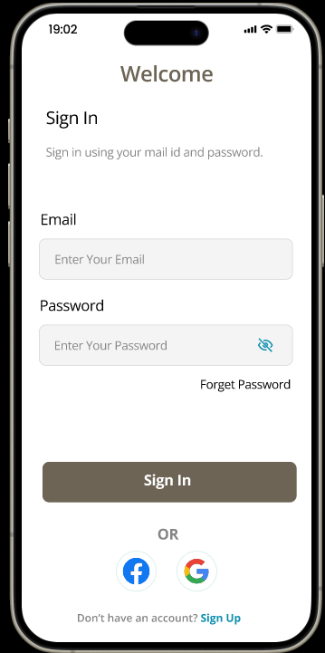
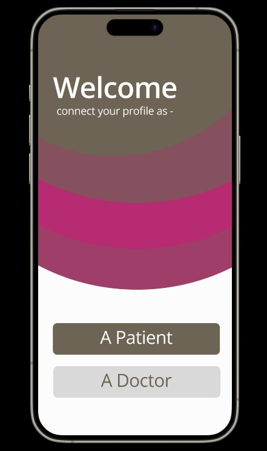
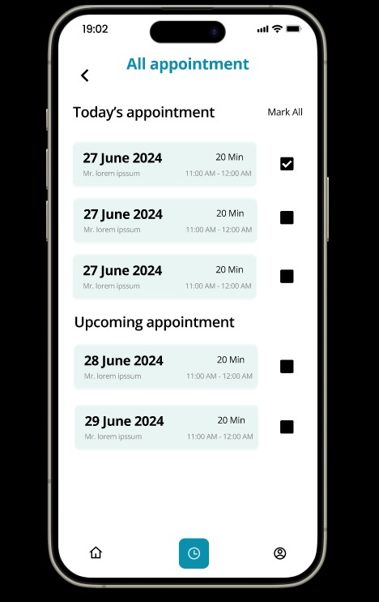
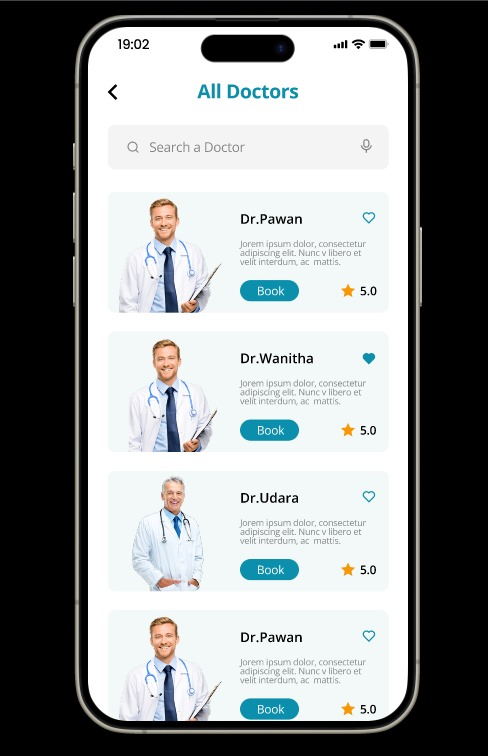
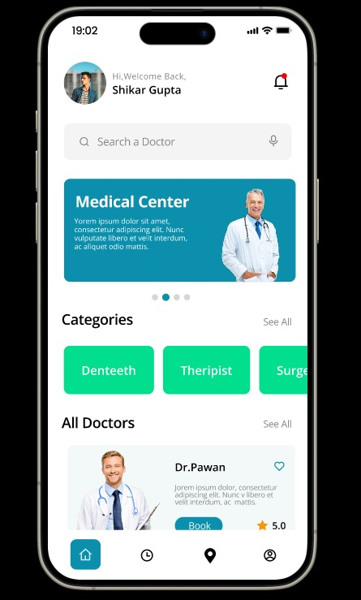
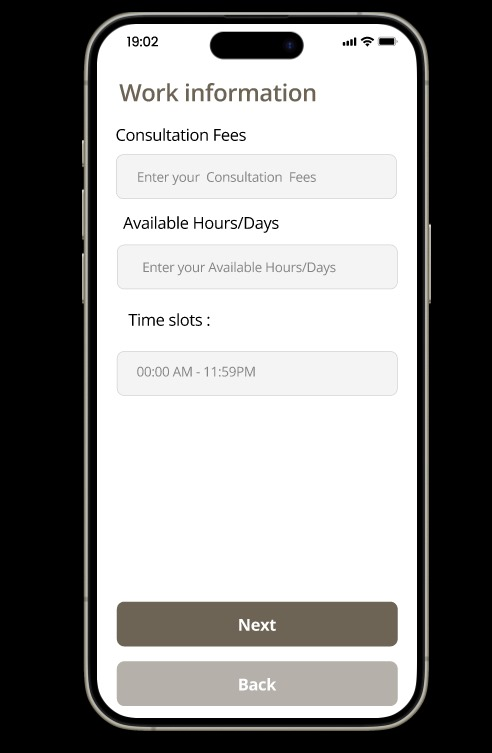

# DocEasy

LINK FOR FIGMA-https://www.figma.com/design/15SpYp6289sFHuuXEdypIR/Doc-Easy?node-id=0-1&t=5ngZAHaOwO2l29wR-1

LINK FOR YOUTUBE-https://youtu.be/Y9UVt7STZWM?si=KvooNQYBU-70LDcr

**Mobile Application for Scheduling an Appointment for a Patient with Doctor**
**1.Problem Statement**
Doctors are lifesavers and that is why they shouldn’t be too far from those who need healthcare. With more and more people having the need to seek medical attention, doctors need to make their services accessible and available to their patients. In this time and age where everything and anything can be found on the internet, we need to take advantage of digital tools/channels to enable quick scheduling of appointments.

**2.Project Overview**
This project aims to develop a digital solution to give patients the freedom to book appointments at any time and from anywhere. The application will offer the following features:

**Find Availability of All Doctors Based on Their Specialty**
Users can search for doctors based on their medical specialty and view their availability.

**Find Doctors Near Your Location with Doctors List Sorted Based on Shortest Distance**
The app will display a list of doctors sorted by proximity to the user's current location.

**Book the Appointment and Receive Confirmation Notification in the App**
Users can book appointments directly through the app and receive immediate confirmation notifications.

**Conflict-Free Scheduling**
The application ensures that there are no conflicting consultations for doctors or patients at the booked time slots.

**Reminder Notification with Driving Directions**
Users will receive a reminder notification one hour before their appointment, including a link to driving directions to the doctor's clinic.

**3.Features**
Doctor Availability: Search and view available time slots for doctors based on their specialty.
Location-Based Search: Find and sort doctors by proximity to the user's location.
Appointment Booking: Easy and quick booking of appointments with instant confirmation.
Conflict-Free Scheduling: Ensures no overlapping appointments for both doctors and patients.
Reminder Notifications: Sends a reminder one hour before the appointment with a link to driving directions.

**4.Technologies Used**
Frontend: Jetpack Compose UI App Development Toolkit
Backend: Kotlin
Database: Firebase
APIs: Google Maps API for location-based services
Notifications: Firebase Cloud Messaging

**5.Installation and Setup**

**5.1 Installation**
git clone https://github.com/shikhargupta442003/veersaDocEasy-main

**5.2 Install the dependencies**																 		Android Studio, dependencies are automatically installed

**5.3 Run the application:																		**for Android Studio, run the app with emulator or physical device

**License**
This project is released under the MIT License.

**Contact**
Open and create an issue for any query

**6.Snapshots of the Application**

         

          

               

**OUR MOBILE APPLICATION LOGO-**

**TEAM MEMBERS-**

1)Shikhar Gupta

2)Sarthak Bansal

3)Vibhor Arora

4)Vrisha Garg
